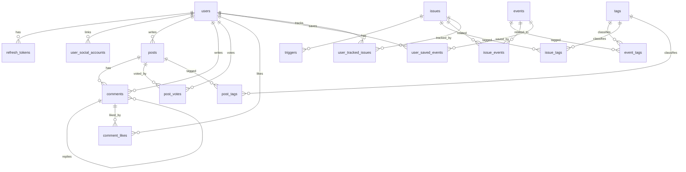

# Trend Korea API DB Schema

기준: `migrations/versions/20260215_000001_init.py` (PostgreSQL)

## 1. 개요

- DB 엔진: PostgreSQL 16
- 마이그레이션 도구: Alembic
- 현재 리비전: `20260215_000001`
- 주요 도메인: 사용자/인증, 사건(Event), 이슈(Issue), 트리거(Trigger), 커뮤니티(Post/Comment), 태그/출처, 검색/작업 로그

## 2. 테이블 목록

- `alembic_version`
- `users`
- `user_social_accounts`
- `refresh_tokens`
- `tags`
- `events`
- `issues`
- `triggers`
- `sources`
- `posts`
- `comments`
- `comment_likes`
- `post_votes`
- `search_rankings`
- `search_histories`
- `job_runs`
- `event_tags`
- `issue_tags`
- `post_tags`
- `issue_events`
- `user_saved_events`
- `user_tracked_issues`

## 3. 도메인별 스키마

### 3.1 사용자/인증

#### `users`

| 컬럼 | 타입 | 제약 |
|---|---|---|
| id | varchar(36) | PK |
| nickname | varchar(50) | NOT NULL, UNIQUE, INDEX |
| email | varchar(255) | NOT NULL, UNIQUE, INDEX |
| password_hash | varchar(255) | NOT NULL |
| profile_image | varchar(500) | NULL |
| role | varchar(20) | NOT NULL |
| is_active | boolean | NOT NULL |
| withdrawn_at | timestamptz | NULL |
| created_at | timestamptz | NOT NULL |
| updated_at | timestamptz | NOT NULL |

#### `user_social_accounts`

| 컬럼 | 타입 | 제약 |
|---|---|---|
| id | varchar(36) | PK |
| user_id | varchar(36) | NOT NULL, FK -> users.id, INDEX |
| provider | varchar(20) | NOT NULL |
| provider_user_id | varchar(100) | NOT NULL |
| email | varchar(255) | NULL |
| created_at | timestamptz | NOT NULL |

#### `refresh_tokens`

| 컬럼 | 타입 | 제약 |
|---|---|---|
| id | varchar(36) | PK |
| user_id | varchar(36) | NOT NULL, FK -> users.id, INDEX |
| token_hash | varchar(64) | NOT NULL, UNIQUE, INDEX |
| jti | varchar(36) | NOT NULL, UNIQUE, INDEX |
| expires_at | timestamptz | NOT NULL |
| revoked_at | timestamptz | NULL |
| created_at | timestamptz | NOT NULL |

### 3.2 사건/이슈/트리거

#### `events`

| 컬럼 | 타입 | 제약 |
|---|---|---|
| id | varchar(36) | PK |
| occurred_at | timestamptz | NOT NULL, INDEX |
| title | varchar(50) | NOT NULL |
| summary | text | NOT NULL |
| importance | varchar(20) | NOT NULL |
| verification_status | varchar(20) | NOT NULL |
| source_count | int | NOT NULL, DEFAULT 0 |
| created_at | timestamptz | NOT NULL |
| updated_at | timestamptz | NOT NULL |

#### `issues`

| 컬럼 | 타입 | 제약 |
|---|---|---|
| id | varchar(36) | PK |
| title | varchar(50) | NOT NULL |
| description | text | NOT NULL |
| status | varchar(20) | NOT NULL, INDEX |
| tracker_count | int | NOT NULL, DEFAULT 0, INDEX |
| latest_trigger_at | timestamptz | NULL, INDEX |
| created_at | timestamptz | NOT NULL |
| updated_at | timestamptz | NOT NULL |

#### `triggers`

| 컬럼 | 타입 | 제약 |
|---|---|---|
| id | varchar(36) | PK |
| issue_id | varchar(36) | NOT NULL, FK -> issues.id, INDEX |
| occurred_at | timestamptz | NOT NULL, INDEX |
| summary | text | NOT NULL |
| type | varchar(20) | NOT NULL |
| created_at | timestamptz | NOT NULL |
| updated_at | timestamptz | NOT NULL |

#### `sources`

| 컬럼 | 타입 | 제약 |
|---|---|---|
| id | varchar(36) | PK |
| entity_type | varchar(20) | NOT NULL, INDEX |
| entity_id | varchar(36) | NOT NULL, INDEX |
| url | varchar(500) | NOT NULL |
| title | varchar(255) | NOT NULL |
| publisher | varchar(100) | NOT NULL |
| published_at | timestamptz | NOT NULL |

### 3.3 커뮤니티

#### `posts`

| 컬럼 | 타입 | 제약 |
|---|---|---|
| id | varchar(36) | PK |
| author_id | varchar(36) | NOT NULL, FK -> users.id, INDEX |
| title | varchar(100) | NOT NULL |
| content | text | NOT NULL |
| is_anonymous | boolean | NOT NULL, DEFAULT false |
| like_count | int | NOT NULL, DEFAULT 0 |
| dislike_count | int | NOT NULL, DEFAULT 0 |
| comment_count | int | NOT NULL, DEFAULT 0 |
| created_at | timestamptz | NOT NULL, INDEX |
| updated_at | timestamptz | NOT NULL |

#### `comments`

| 컬럼 | 타입 | 제약 |
|---|---|---|
| id | varchar(36) | PK |
| post_id | varchar(36) | NOT NULL, FK -> posts.id, INDEX |
| parent_id | varchar(36) | NULL, FK -> comments.id |
| author_id | varchar(36) | NOT NULL, FK -> users.id |
| content | text | NOT NULL |
| like_count | int | NOT NULL, DEFAULT 0 |
| created_at | timestamptz | NOT NULL, INDEX |
| updated_at | timestamptz | NOT NULL |

#### `comment_likes`

| 컬럼 | 타입 | 제약 |
|---|---|---|
| id | varchar(36) | PK |
| comment_id | varchar(36) | NOT NULL, FK -> comments.id, INDEX |
| user_id | varchar(36) | NOT NULL, FK -> users.id, INDEX |
| created_at | timestamptz | NOT NULL |

Unique: `(comment_id, user_id)` (`uq_comment_like_user`)

#### `post_votes`

| 컬럼 | 타입 | 제약 |
|---|---|---|
| id | varchar(36) | PK |
| post_id | varchar(36) | NOT NULL, FK -> posts.id, INDEX |
| user_id | varchar(36) | NOT NULL, FK -> users.id, INDEX |
| vote_type | varchar(10) | NOT NULL |
| created_at | timestamptz | NOT NULL |

Unique: `(post_id, user_id)` (`uq_post_vote_user`)

### 3.4 태그/연결 테이블

#### `tags`

| 컬럼 | 타입 | 제약 |
|---|---|---|
| id | varchar(36) | PK |
| name | varchar(50) | NOT NULL |
| type | varchar(20) | NOT NULL |
| slug | varchar(80) | NOT NULL, UNIQUE, INDEX |
| updated_at | timestamptz | NOT NULL |

#### 다대다 연결 테이블

- `event_tags(event_id FK -> events.id, tag_id FK -> tags.id, PK(event_id, tag_id))`
- `issue_tags(issue_id FK -> issues.id, tag_id FK -> tags.id, PK(issue_id, tag_id))`
- `post_tags(post_id FK -> posts.id, tag_id FK -> tags.id, PK(post_id, tag_id))`
- `issue_events(issue_id FK -> issues.id, event_id FK -> events.id, PK(issue_id, event_id))`
- `user_saved_events(user_id FK -> users.id, event_id FK -> events.id, saved_at, PK(user_id, event_id))`
- `user_tracked_issues(user_id FK -> users.id, issue_id FK -> issues.id, tracked_at, PK(user_id, issue_id))`

### 3.5 검색/배치

#### `search_rankings`

| 컬럼 | 타입 | 제약 |
|---|---|---|
| id | varchar(36) | PK |
| keyword | varchar(100) | NOT NULL, INDEX |
| rank | int | NOT NULL |
| score | int | NOT NULL |
| calculated_at | timestamptz | NOT NULL, INDEX |

#### `search_histories`

| 컬럼 | 타입 | 제약 |
|---|---|---|
| id | varchar(36) | PK |
| user_id | varchar(36) | NOT NULL, INDEX |
| keyword | varchar(100) | NOT NULL |
| created_at | timestamptz | NOT NULL, INDEX |

#### `job_runs`

| 컬럼 | 타입 | 제약 |
|---|---|---|
| id | varchar(36) | PK |
| job_name | varchar(100) | NOT NULL, INDEX |
| status | varchar(20) | NOT NULL |
| detail | text | NULL |
| started_at | timestamptz | NOT NULL |
| finished_at | timestamptz | NULL |

## 4. ER (요약)

## 5. 운영 참고

- enum 값은 애플리케이션 코드 `src/trend_korea/domain/enums.py` 기준으로 관리됩니다.
- `sources.entity_type/entity_id`는 다형 참조 패턴이며 DB FK 제약은 없습니다.
- API 스펙 확장 시(예: Community feed/Activity 고도화) 인덱스와 history 테이블 증설을 권장합니다.
